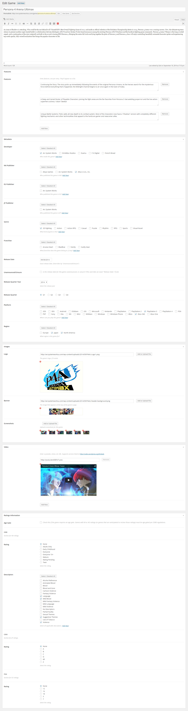
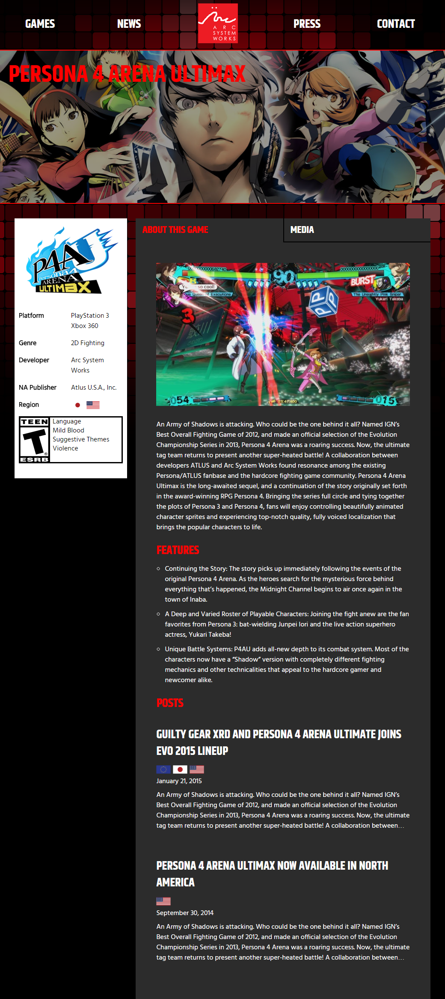

This site was developed as a point of outreach and information-dissemination for NA/EU releases of games created by Japanese developer Arc System Works. The primary purpose was to create an authoritative source of information about games as they are announced for release outside of Japan.

The design was provided to me by my [client](http://scmedia.com), and I was tasked with developing a WordPress backend to handle some of their unique requirements. Some of the most notable parts of this projects were:

- Custom post types to manage the game catalog
- Metaboxes to make data entry easy for the client
- Flexible, animated carousel in header
- AJAX-loaded post backlog

The game catalog is the highlight of the site from a development perspective. Each "game"-type post collects metadata for that product, including developer, publisher(s), genre, release date, platform, and region. Most metadata is stored with the use of custom taxonomies which allows for fast, dyanmic searches and sorting. This taxonomy backend, in concert with [MixItUp](https://mixitup.kunkalabs.com/), is what powers the game archive page: [arcsystemworksu.com/games](http://arcsystemworksu.com/games/). Each game can also store ratings information (i.e. ESRB, PEGI). Any ESRB ratings information entered will be displayed in accordance with that body's standards.

The "game"-type posts make extensive use of the [CMB2](https://github.com/WebDevStudios/CMB2) metabox plugin to make date entry easy, and to help avoid errors.

_The back-end for the "game" post type, which allows for easy entry of all game-related information. (Not all data is shown in this image.)_

_How the game data is displayed on the web site. Screenshots and videos are shown on the "media" tab._
