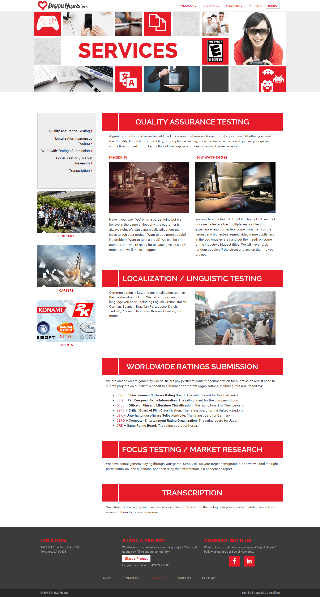
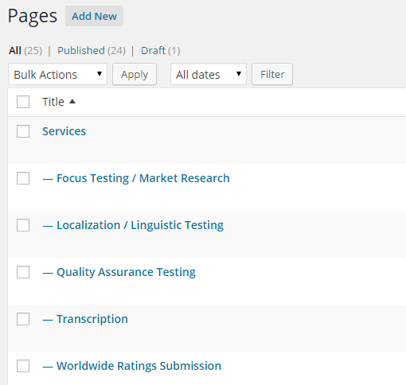

This site was intended to be a redesign and update of the web presence for the USA branch of Digital Hearts, a company that provides a number of localization, development, and marketing services for video games. 

I was contracted to build the site based on a design provided by my [client](http://scmedia.com). Some of the notable elements of this build are:

- Each section of the site is a separate WordPress page object, but they are displayed together. This is done to make it easier to manage on the backend.
- The nav menus (top a mobile slide-in) use custom code that allows them to build lists based page heirarchy and link to anchors instead of discreet pages.
- Custom post type for "clients" to allow Digital Hearts to easily add new clients to be displayed.

Although making each "section" (i.e. "Quality Assurance Testing," "Transcription") of the site's top-level pages (i.e. "Company," "Services") individual WordPress page objects allows for easier management of content by the client, it presented a unique challenge for our nav menus. The default WordPress nav assumes that each item on it links to a discreet page, so I wrote a set of functions that look for the child pages of the various top-level pages, and then build lists that link to anchors based on the page slugs. 

_The "Services" page, which shows several sections displayed on a single page._

_This shows the structure of these pages in the back-end, which makes it simple for the client to edit._
