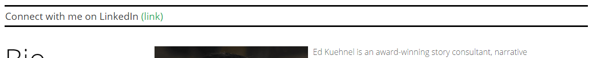
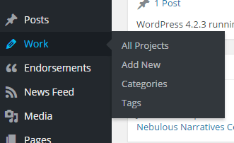
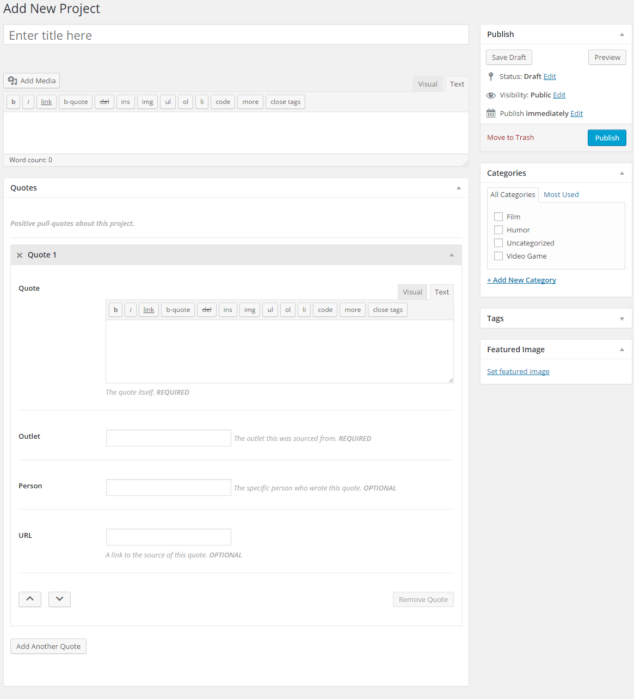
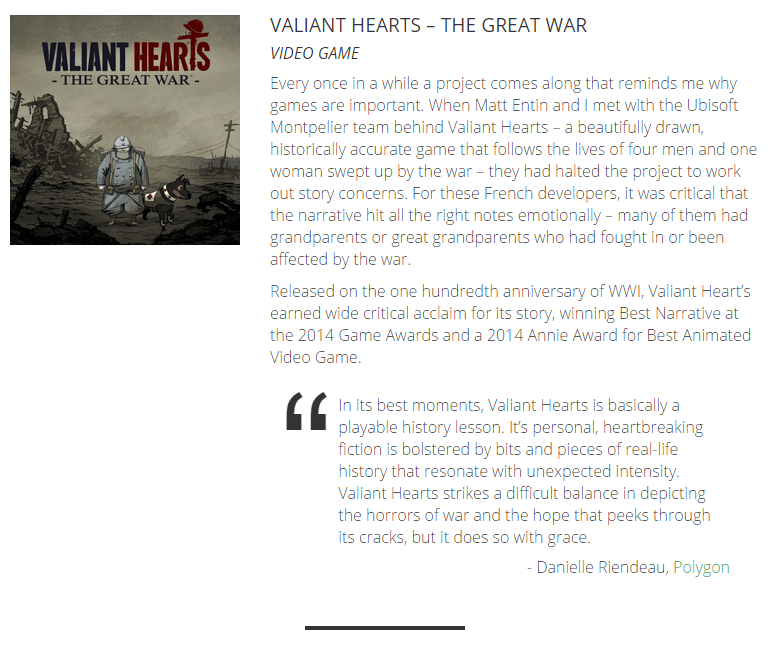

This site was designed to serve as a portfolio and point of contact for [Ed Kuehnel](http://edwritesgames.com/), a story consultant, narrative designer, and screenwriter.

The design was created internally and approved by the client, and I developed the WordPress backend to meet his needs. Some of this project's notable challenges were:

- Custom post types to manage portfolio items, news micro-feed, and endorsements
- Metaboxes to make data entry easy for the client
- Simple, elegant design

As a portfolio and point of contact for clients, the site needed to quickly present information with minimal fuss. Given that my client is an individual and not a company with numerous employees, it was also important that the site be simple and intuitive to update. My client also specifically requested a small, one-line "news micro-feed":

This feature would allow him to add simple, short updates or links to be displayed on every page of the site. It was implemented through a combination of metaboxes, via [CMB2](https://github.com/WebDevStudios/CMB2), and custom post types.

In addition to simplifying programming and management, the extensive use of custom post types in the project also provide a clear semantic framework when updating the site: Portfolio items are simply "Work," not some less-intuitive and semantically inaccurate construction such as "posts in the 'work' category."

_The project creation view._

_How projects appear on the front end._
