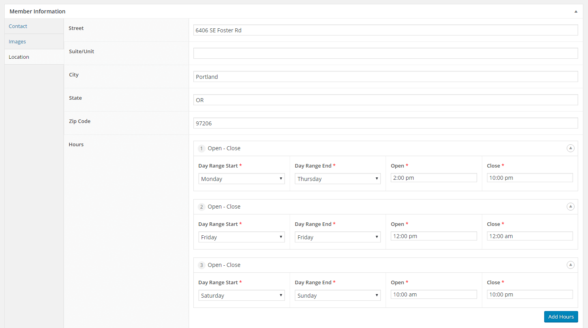
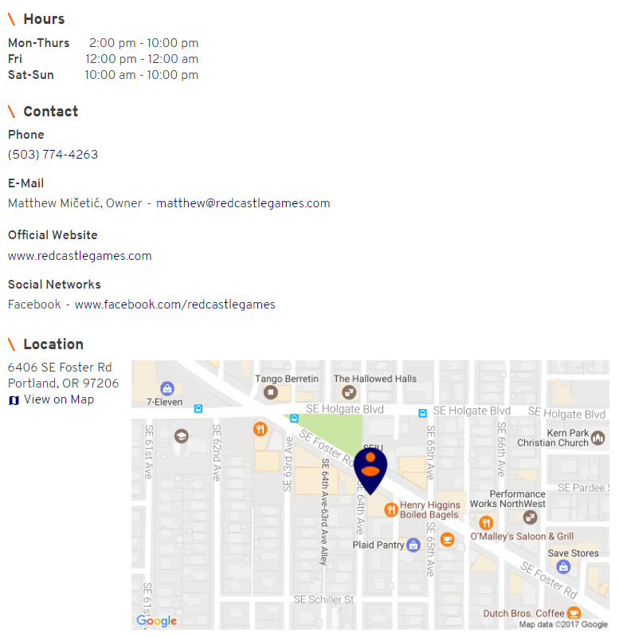
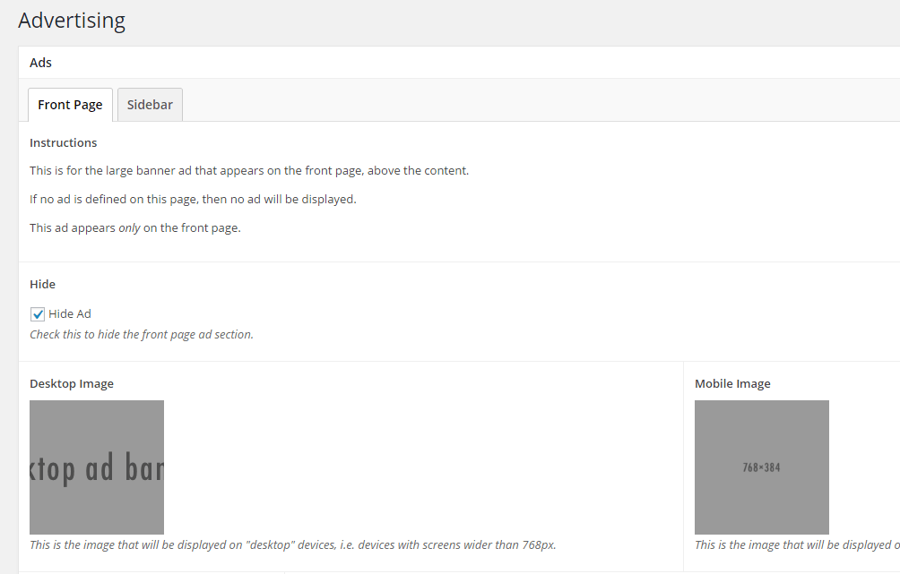

The Foster Area Business Association is a group of allied businesses in Portland, Oregon's up-and-coming Foster-Powell neightborhood. Their old web site was essentially non-existent, so they pursed a grant from the city to commission a new one. Marina Martinez Consulting won the contact and hired me to do the design and development.

The budget was limited, so the site was designed to be simple yet usable, both in design and functionality. Since it was likely to be further enhanced as more money became available to the business association, I attempted to structure its content to be as ameniable to change and improvement as possible.

To this end, the core of the site was built around a "member" post type, each representing a differnent member. Each member post object included metadata about their business, and could be categories by the type of business (i.e. "Food/Drink", "Professional Services", etc) and their status (i.e "Active", "Board Member", etc). This allowed for easy categorization, both for the people managing the site, and for users visiting it. A group of randomly-selected members are also dispalyed on the front page with each page load, to help bring awareness to everyone involved in the organization.

_The "Location" section of the member metadata._

_How the 'Location' metadata appears on the frontend._

A simple ad implementation was also designed, allowing placemen of ad banners at the top of the front page and on the sidebar. Currently, however, no ads are displayed.

_The ad placement backend._
